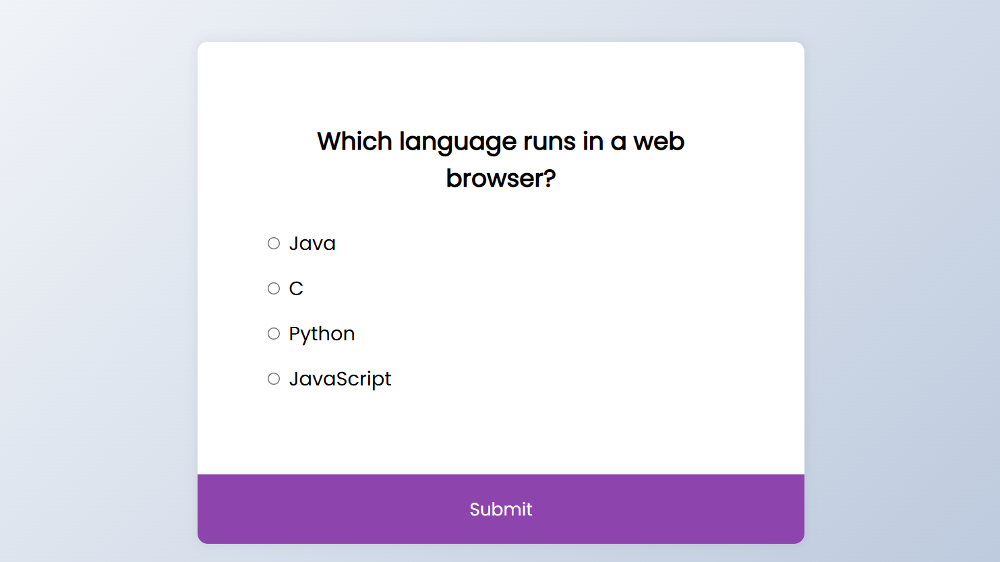

# 🧠 QuizzyMind – Challenge Your Knowledge, One Click at a Time! 

**🧠 Why This App?**
“Because sometimes, the best way to learn... is to play.”

QuizzyMind is more than just a quiz. It's your mini knowledge dojo right in the browser.
Quick to run, fun to use, and easy to customize.

Welcome to **QuizzyMind**, a clean, fun, and addictive quiz built with nothing but **HTML**, **CSS**, and **JavaScript** – no frameworks, no databases, just your browser and your brain. 🚀

Whether you're a trivia rookie or a seasoned quiz champ, **QuizzyMind** is a delightful way to sharpen your knowledge and keep your mind buzzing. ✨

---

## 💡 Features

✅ **Simple and Intuitive UI**  
Clean layout with smooth transitions and responsive design – quiz-taking made easy.

✅ **Multiple Choice Questions**  
Select the correct option from a list – just point and click!

✅ **Instant Question Loading**  
No waiting, no loading screens – just fast, snappy interactions.

✅ **Score Display**  
Keep track of your right answers and brag about it (or try again)!

✅ **No External Dependencies**  
Runs entirely in the browser with pure HTML, CSS, and JavaScript.

---

## 🚀 Tech Stack

| Tech | Description |
|------|-------------|
| 🧱 HTML5 | Structure & Layout |
| 🎨 CSS3  | Styling & Responsiveness |
| ⚙️ JavaScript | Logic & Interactivity |

---

## 🖼️ Sneak Peek
> 💡 “It’s not just a quiz. It’s a brain-battle in your browser.”

## LIVE DEMO

